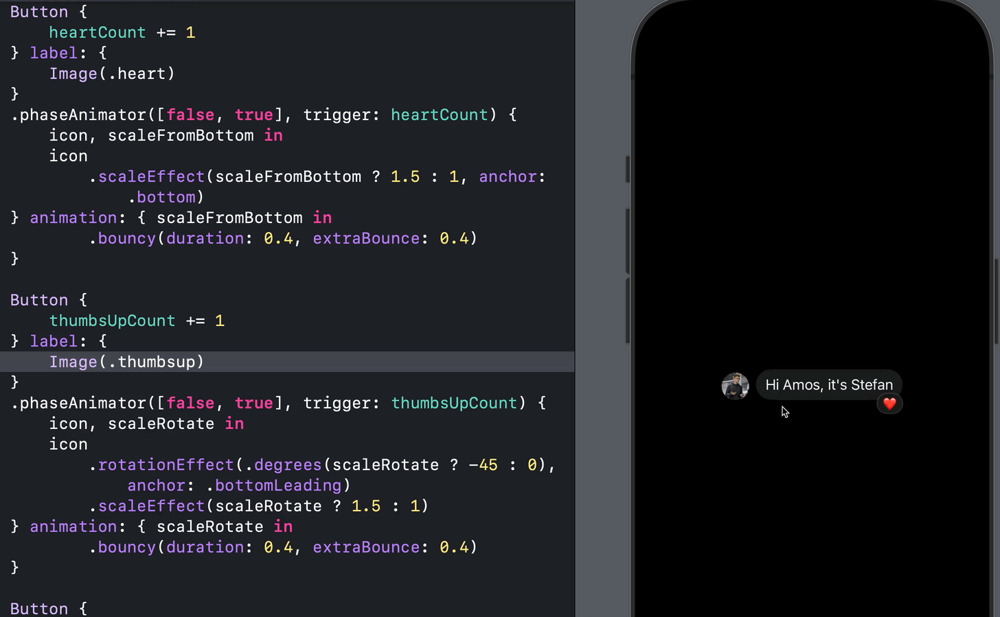
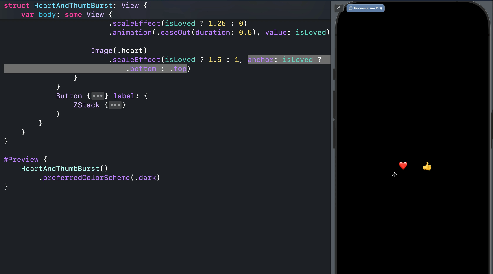
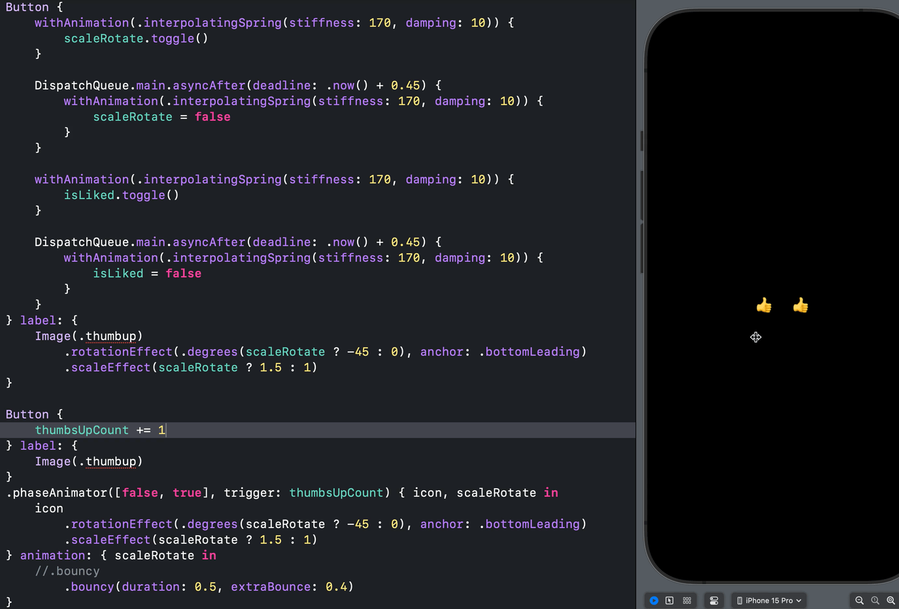
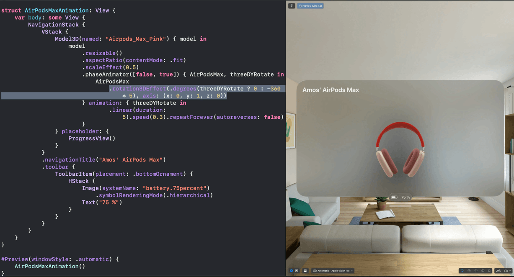

## Open SwiftUI Animations
### Pure SwiftUI animations and inspirations for your next iOS, macOS, visionOS and watchOS projects. Enjoy 😊 

Checkout the Xcode project for examples of the new Phase Animator, Keyframe Animation, and Spring Animations for iOS 17 and beyond. Something missing or found an intersting iOS animation fo add? Contact me on X: [@amos_gyamfi](https://twitter.com/amos_gyamfi) 

**Reactions with Springs**: [EmotionalReactions.swift]()

---

**Animating Achors**: [AnchorMovement.swift]()

---

**Achieving Bounce**: [BouncyAlternatives.swift]()

---

**3D Y-Rotation - visionOS**: [AirPodsMaxThreeDYRotation.swift]()

---

**SwiftUI 2024 Christmas Tree**: [SwiftUIChristmasTree.swift]()

---

