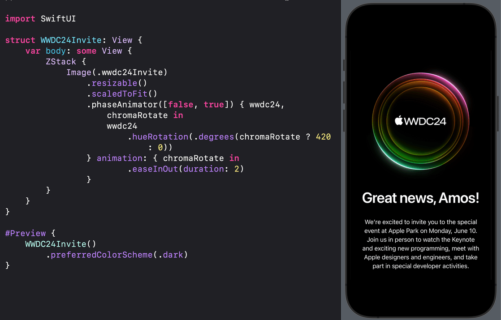
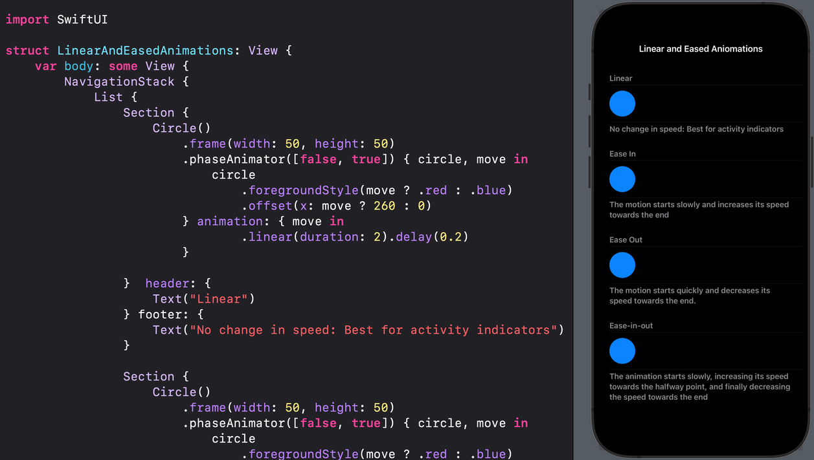
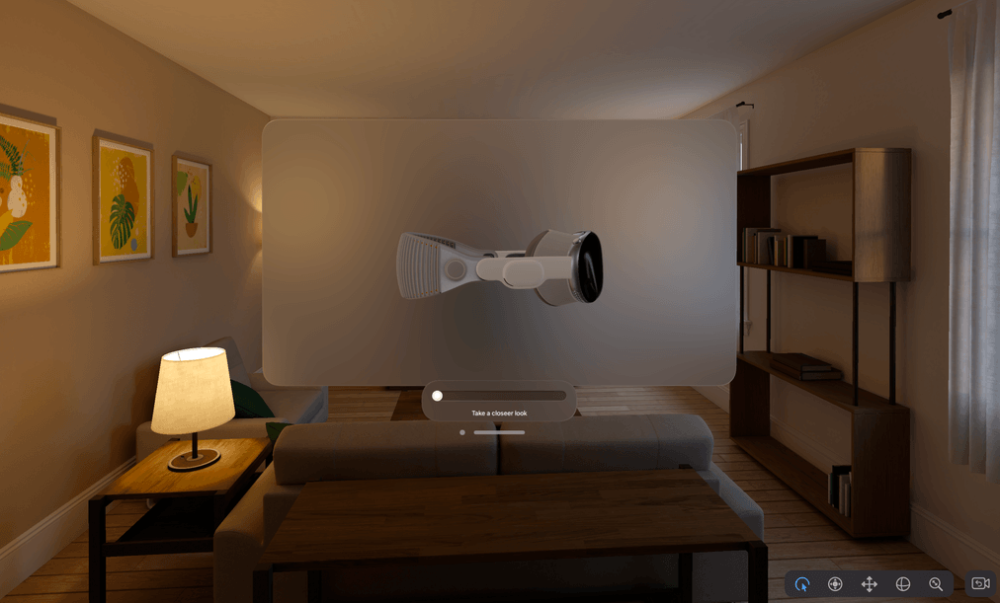
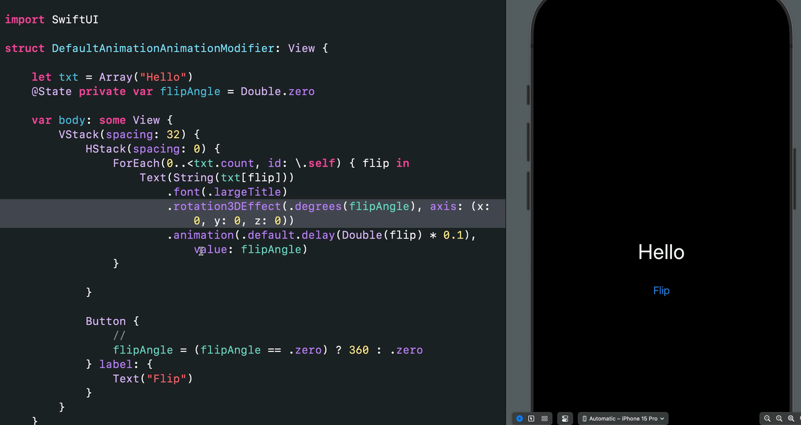
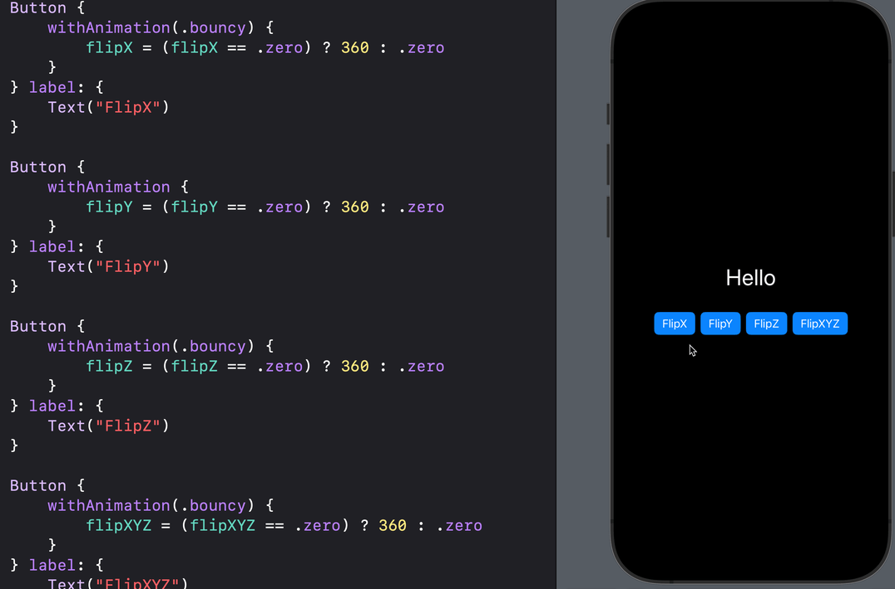
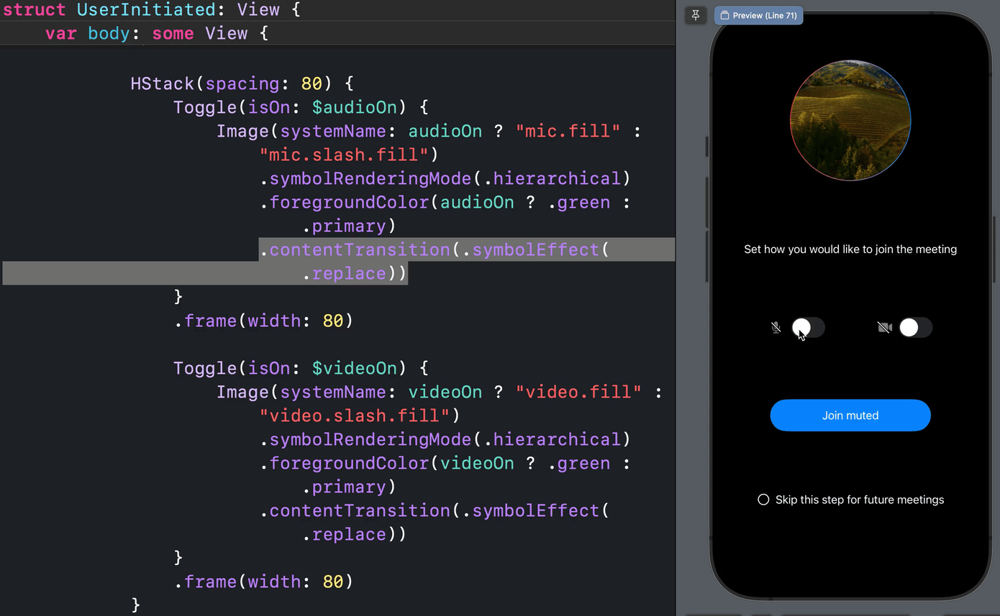
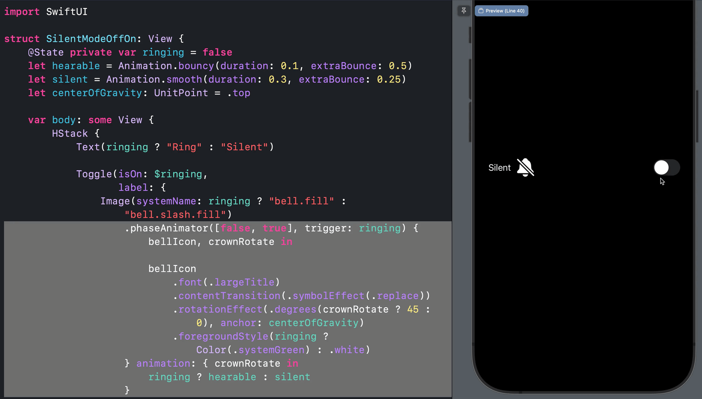
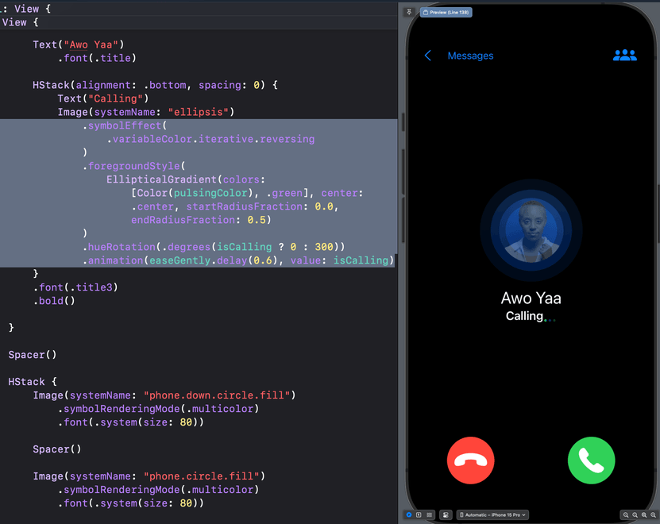

## Open SwiftUI Animations
### Pure SwiftUI animations and inspirations for your next iOS, macOS, visionOS, and watchOS projects. Enjoy 😊. 

SwiftUI animation is compelling and superb. With minimal effort, you can add incredible effects and beautiful animations to your apps. **Why use an animation library instead of creating these tiny effects yourself?** Get inspiration from here and start building your SwiftUI animations today. 

### Hue Rotation effect with Phase Animator 

---

### Hello WWDC24 

---

Check out the Xcode project for examples of the new Phase Animator, Symbol Effects, Keyframe Animation, and Spring Animations for iOS 17 and beyond. Is something missing, or did you find an interesting iOS animation to add? Contact me on X: [@amos_gyamfi](https://twitter.com/amos_gyamfi) 

### How Things Move: Constant speed, acceleration, deceleration

---

### Vision Pro 3D rotation 

---

### 3D Rotate String Characters 

---

### Flip String Characters in XYZ

---

**Reactions with Springs**: [EmotionalReactions.swift](OpenSwiftUIAnimations/Reactions/MessengerReactions/EmotionalReactions.swift)

---

**SwiftUI 2024 Christmas Tree**: [SwiftUI Christmas Tree](OpenSwiftUIAnimations/ChristmasTree)

---

**Expressive Reactions**: [IncomingMessageView.swift](OpenSwiftUIAnimations/Reactions/MessengerReactions/IncomingMessageView.swift)

---

**Content Transition: Smooth Symbols Swapping**: [Add soon]()

---

**Content Transition, Phase Animator with Springs: Create seamless icon replacement: [Add soon]()

---

**X Like Animation**: [XLike Animation](OpenSwiftUIAnimations/Reactions/XLike)

---

**Animating Achors**: [Add soon]()

---

**Achieving Bounce**: [Add soon]()

---

**3D Y-Rotation - visionOS**: [Add soon]()

---

**Incoming call animation, symbol effect with variable color and hue rotation**: [IncomingCall.swift](https://gist.github.com/amosgyamfi/26ba8cbecac18202c6f2065836297766#file-incomingcall-swift)

---

