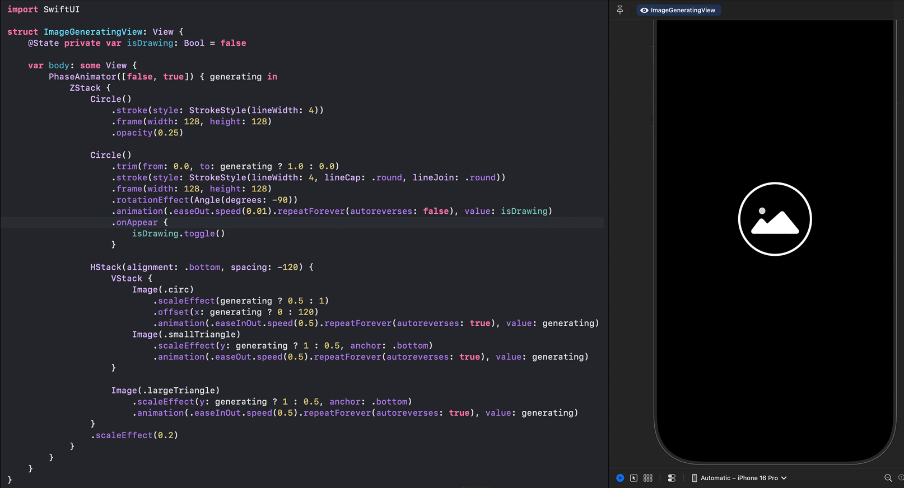
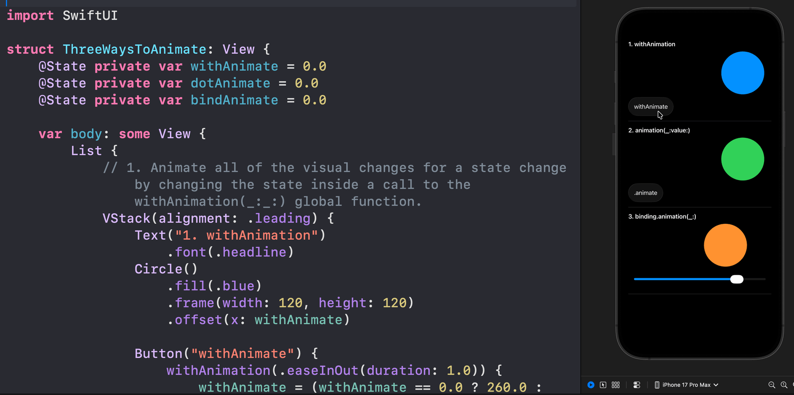
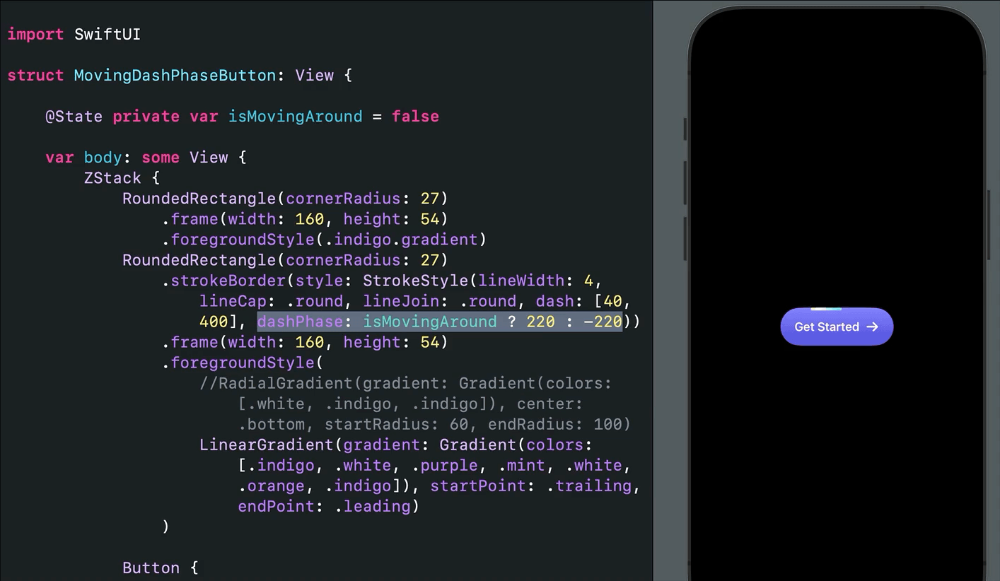
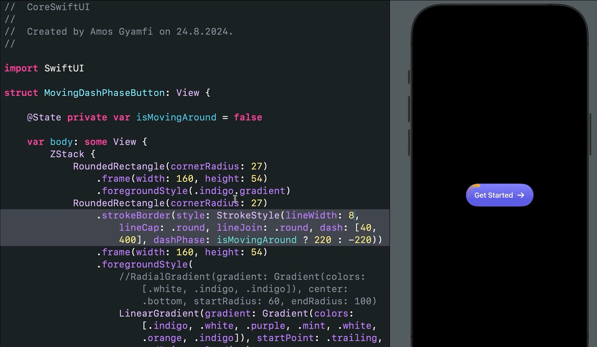
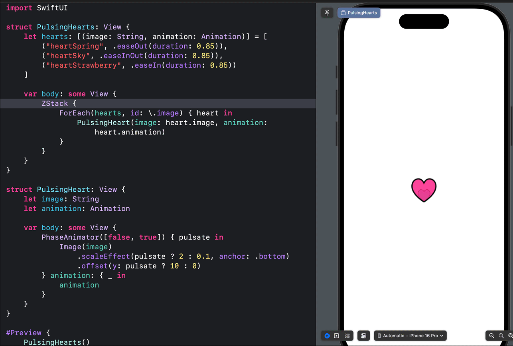
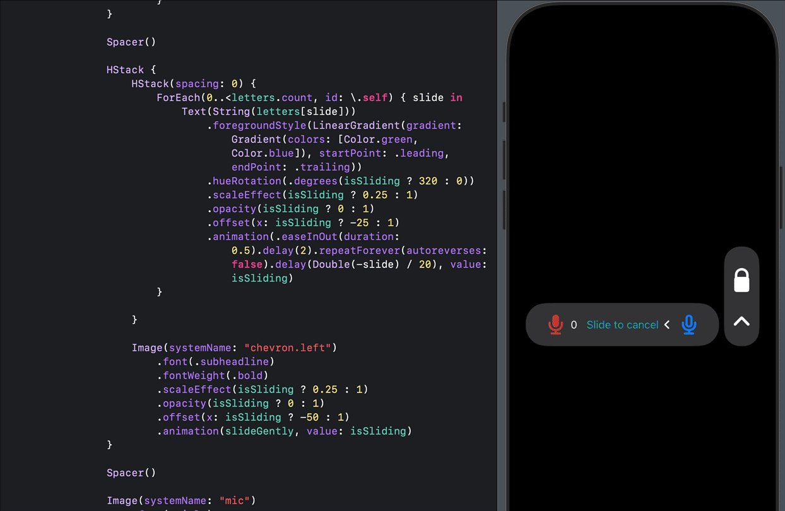
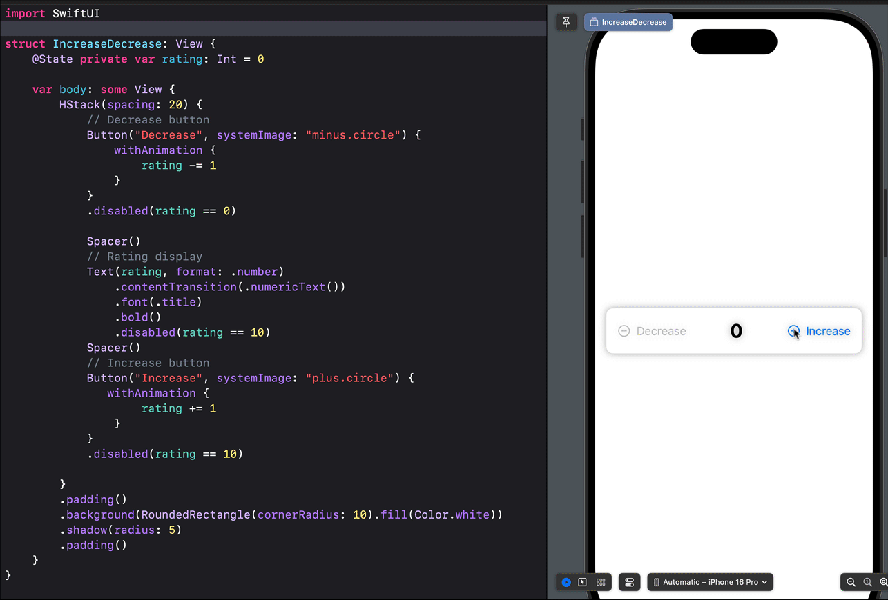
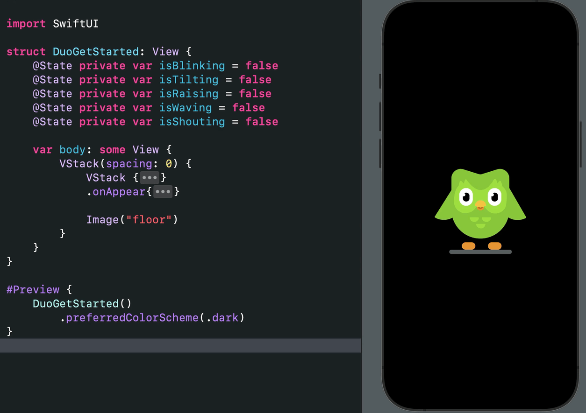
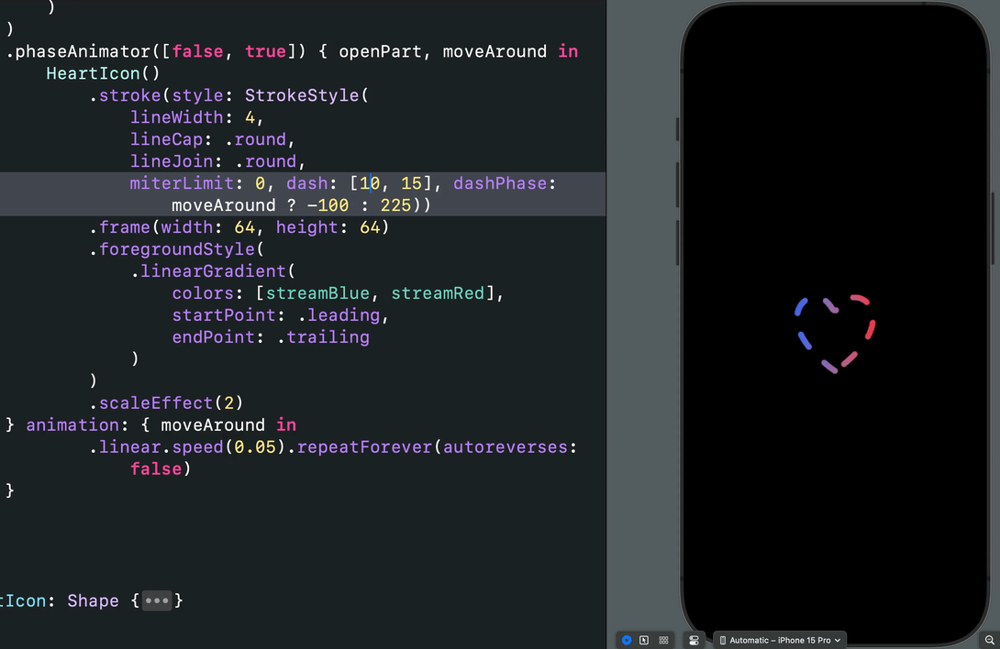
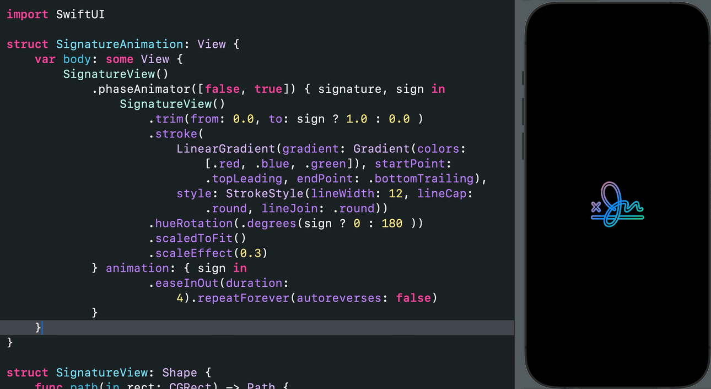

## Open SwiftUI Animations
### Pure SwiftUI animation inspirations for your next iOS, macOS, visionOS, and watchOS projects. Enjoy 😊. 

### Animate Anything With SwiftUI


SwiftUI animation is compelling and superb. With minimal effort, you can add incredible effects and beautiful animations to your apps. **Why use an animation library instead of creating these tiny effects yourself?** Get inspiration from [here](OpenSwiftUIAnimations) and start building your SwiftUI animations today. Most animations here are based on the animations section in the [Apple Developer Documentation](https://developer.apple.com/documentation/swiftui/animations). Check out the [Xcode project](OpenSwiftUIAnimations) for examples of the new [Phase Animator](https://developer.apple.com/documentation/swiftui/phaseanimator), Symbol Effects, [Keyframe Animator](https://developer.apple.com/documentation/swiftui/keyframeanimator), and [Spring Animations](https://developer.apple.com/documentation/swiftui/spring) for iOS 17 and beyond. Would you like to see an animation that is not here, or did you find an engaging one to add? Contact me on X: [@amos_gyamfi](https://twitter.com/amos_gyamfi) or add it as a task in the [project's backlog](https://github.com/users/amosgyamfi/projects/1/views/1). 

Starting in 2025, I will generate some of the SwiftUI animations using SOTA models like Gemini 2.5 Pro, Claude 3.7 Sonnet, OpenAI o3, and o4-mini models.
---

### Liquid Glass Shape Morphing Animation With GlassEffectContainer: [Gist](https://github.com/amosgyamfi/swiftui_tutorial_projects/blob/master/Gist/LiquidGlassEffectContainer.swift)

```swift
import SwiftUI

struct LiquidGlassEffectContainer: View {
    var body: some View {
        GlassEffectContainer(spacing: 50) {
            PhaseAnimator([false, true]) { morph in
                HStack(spacing: morph ? 50.0 : -15.0) {
                    Button {
                        //
                    } label: {
                        Image(systemName: "scribble.variable")
                    }
                    .padding()
                    .glassEffect()
                    
                    Button {
                        //
                    } label: {
                        Image(systemName: "eraser.fill")
                    }
                    .padding()
                    .glassEffect()
                }
                .tint(.green)
                .font(.system(size: 64.0))
            } animation: { morph in
                    //.bouncy(duration: 2, extraBounce: 0.5)
                    //.easeOut(duration: 2)
                    .easeInOut(duration: 2)
                    //.timingCurve(0.68, -0.6, 0.32, 1.6, duration: 2)
                    
            }
        }
    }
}

#Preview {
    LiquidGlassEffectContainer()
        .preferredColorScheme(.dark)
}
```
---

### Image generation loader: [Gist](https://gist.github.com/amosgyamfi/b9fb404fcc1fc14b735f84095b8f7552#file-imagegenerationloader-swift)


---

### 3 Ways to add animations: [Gist](https://github.com/amosgyamfi/open-swiftui-animations/blob/master/Gists_To_Try/ThreeWaysToAnimate.swift)  


---

### Gemini 2.5 Pro + OpenAI o3 SwiftUI-generated animations: [Gist](https://github.com/amosgyamfi/open-swiftui-animations/blob/master/Gists_To_Try/Gemini_25_With_OpenAI_o3_Animation.swift). Note: The animations are unedited. Modify and use them to suit your needs.  


---

### SwiftUI Fireworks Animation: [Gist](https://github.com/amosgyamfi/open-swiftui-animations/blob/master/Gists_To_Try/GeminiFireworksAnimation.swift) - Before running the code, ensure you have a small image like "Spark.png" in your assets catalog. 


---

### Thinking, Weighing Options, Evaluating Sentence 

---

### SwiftUI Moving Border With dashPhase 

---

### Getting Inner and Outer Borders 

---

### [PulsingHearts.swift](https://github.com/amosgyamfi/open-swiftui-animations/blob/master/OpenSwiftUIAnimations/FitnessActivityAnimations/PulsingHearts.swift)  

---

### [SlideToUnlock.swift](https://github.com/amosgyamfi/open-swiftui-animations/blob/master/OpenSwiftUIAnimations/SlideToCancelAnimations/SlideToCancelWithScale.swift): Find [All Variations](https://github.com/amosgyamfi/open-swiftui-animations/tree/master/OpenSwiftUIAnimations/SlideToCancelAnimations) 

---


### [CrossFadeNumericTransition.swift](https://github.com/amosgyamfi/open-swiftui-animations/blob/master/OpenSwiftUIAnimations/HumanInitiatedAnimations/IncreaseDecrease.swift) 

---

### Hue Rotation effect with Phase Animator 

---

### Hello WWDC24 

---

### Duolingo getting started and loading animations

---

### How Things Move: Constant speed, acceleration, deceleration

---

### Vision Pro 3D rotation 

---

### 3D Rotate String Characters 

---

### Flip String Characters in XYZ

---

### Use DashPhase to move dashes around a shape. 

---

### Animated Signature: Use trimming to draw and erase the path. 

---

**Reactions with Springs**: [EmotionalReactions.swift](OpenSwiftUIAnimations/Reactions/MessengerReactions/EmotionalReactions.swift)

---

**SwiftUI 2024 Christmas Tree**: [SwiftUI Christmas Tree](OpenSwiftUIAnimations/ChristmasTree)

---

**Expressive Reactions**: [IncomingMessageView.swift](OpenSwiftUIAnimations/Reactions/MessengerReactions/IncomingMessageView.swift)

---

**Content Transition: Smooth Symbols Swapping**: [Add soon]()

---

**Content Transition, Phase Animator with Springs: Create seamless icon replacement: [Add soon]()

---

**X Like Animation**: [XLike Animation](OpenSwiftUIAnimations/Reactions/XLike)

---

**Animating Achors**: [Add soon]()

---

**Achieving Bounce**: [Add soon]()

---

**3D Y-Rotation - visionOS**: [Add soon]()

---

**Incoming call animation, symbol effect with variable color and hue rotation**: [IncomingCall.swift](https://gist.github.com/amosgyamfi/26ba8cbecac18202c6f2065836297766#file-incomingcall-swift)

---


